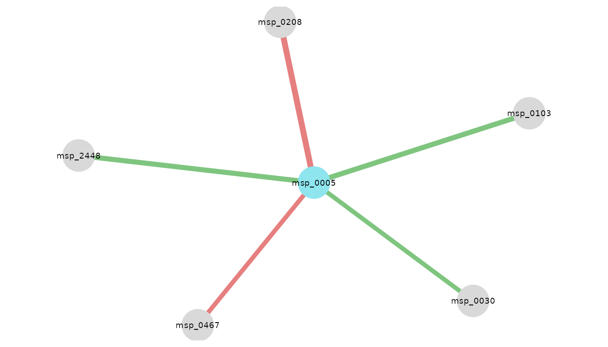
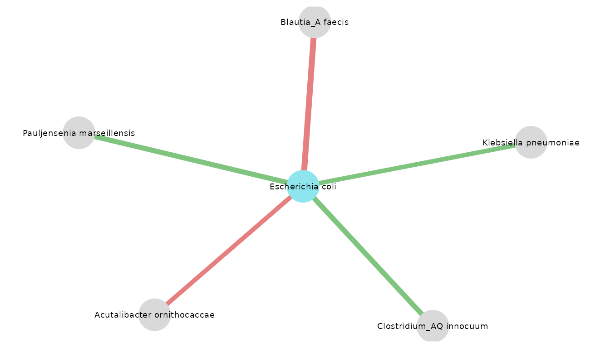
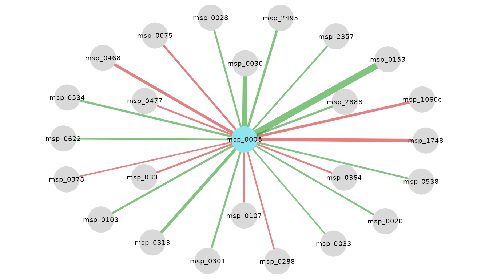
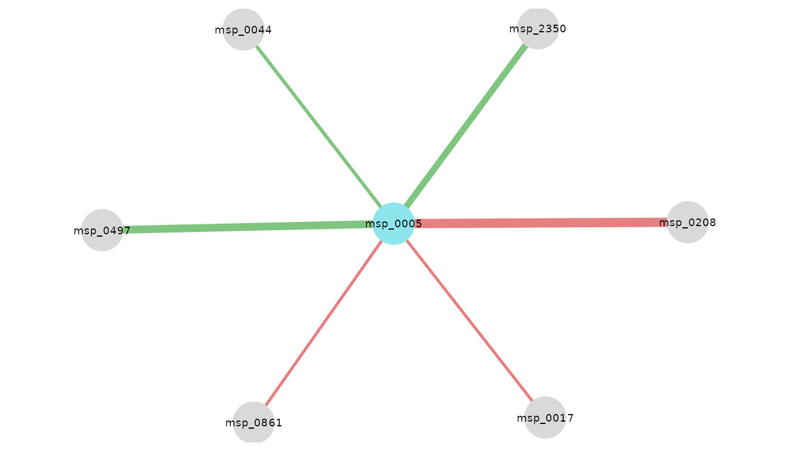
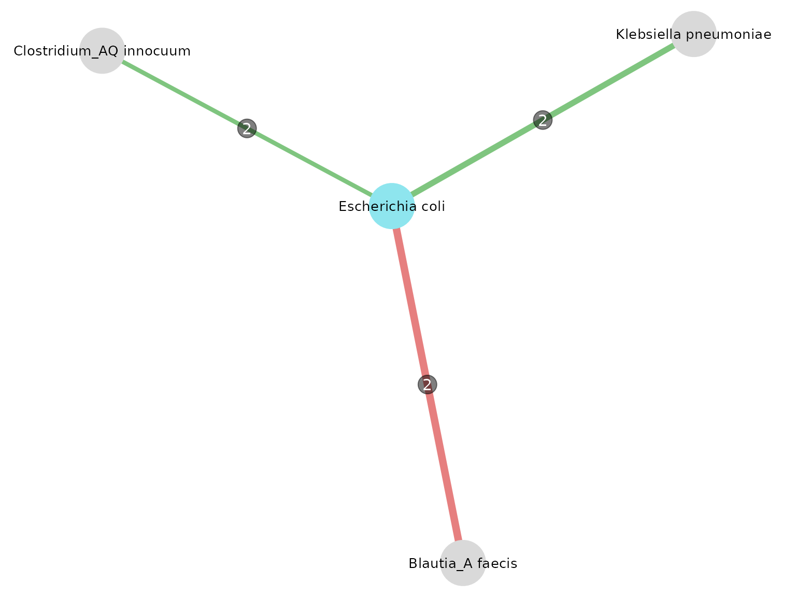

# Detailed example

``` r

library(rmarkdown)
library(knitr)
library(neighborfinder)
#> 
#> Attaching package: 'neighborfinder'
#> The following object is masked from 'package:rmarkdown':
#> 
#>     metadata
```

## Presentation of dataset: CRC Example

The data provided in the package was extracted from this repository:
[Taxonomic profiles, functional profiles and manually curated metadata
of human fecal metagenomes from public projects coming from colorectal
cancer studies](https://doi.org/10.57745/7IVO3E)

Three subgroups are defined following 3 geographic areas: Japan, China
and Europe (gathering Italy, Austria, Germany and France). The focus is
on patients with colorectal cancer.

## Preview of the data

Below, each object needed in this tutorial is loaded and a preview is
displayed.

### 1) The abundance table

Here is a preview of what an abundance table from the data object looks
like, with species as rows and samples as columns. The first column is
the taxonomic annotation at the species level, the second one is the
module ID, and then each column is a sample.

``` r

data(data)
data$CRC_JPN[1:5, 1:5] %>% kable()
```

| species                      | msp_id   | DRS091121 | DRS091048 | DRS091122 |
|:-----------------------------|:---------|----------:|----------:|----------:|
| Blastocystis sp. subtype 3   | msp_0001 |     0e+00 |     0e+00 |     0e+00 |
| Blastocystis sp. subtype 1   | msp_0002 |     0e+00 |     0e+00 |     0e+00 |
| Bacteroides cellulosilyticus | msp_0003 |     0e+00 |     8e-07 |     2e-07 |
| Blastocystis sp. subtype 2   | msp_0004 |     0e+00 |     0e+00 |     0e+00 |
| Escherichia coli             | msp_0005 |     1e-07 |     9e-07 |     0e+00 |

### 2) The metadata

The metadata gathers characteristics (in columns) for each sample (in
rows).

``` r

data(metadata)
metadata$CRC_JPN[1:5, 1:5] %>% kable()
```

| sample | HQ_clean_read_count | gut_mapped_read_count | gut_mapped_pc | oral_mapped_read_count |
|:---|---:|---:|:---|---:|
| DRS091371 | 39159954 | 32390300 | 82.7128142183211 | 32390300 |
| DRS091370 | 35443586 | 28999607 | 81.8190546520885 | 28999607 |
| DRS091369 | 43922552 | 36841645 | 83.8786530436574 | 36841645 |
| DRS091368 | 29627016 | 25334944 | 85.5129790998864 | 25334944 |
| DRS091366 | 49606076 | 41361270 | 83.3794432762632 | 41361270 |

### 3) The taxonomy

The taxonomic file indicates for each msp (*i.e.* metagenomic species)
its species and genus annotation as well as the catalog in which the msp
is mostly found.

``` r

data(taxo)
taxo[1:5, ] %>% kable()
```

| msp_id   | species                      | genus        | catalogue  |
|:---------|:-----------------------------|:-------------|:-----------|
| msp_0001 | Blastocystis sp. subtype 3   | Blastocystis | gut        |
| msp_0002 | Blastocystis sp. subtype 1   | Blastocystis | gut        |
| msp_0003 | Bacteroides cellulosilyticus | Bacteroides  | gut        |
| msp_0004 | Blastocystis sp. subtype 2   | Blastocystis | gut        |
| msp_0005 | Escherichia coli             | Escherichia  | gut & oral |

### 4) The graph

This dataframe is an adjacency matrix encoding the graph with
“cluster-like” structure produced with
[`graph_step()`](../reference/graph_step.md). A value of 1 corresponds
to an edge. This object is needed to simulate semi-synthetic data.

``` r

data(graphs)
graphs$CRC_JPN[1:5, 1:5] %>% kable()
```

|          | msp_0003 | msp_0005 | msp_0007 | msp_0008 | msp_0009 |
|:---------|---------:|---------:|---------:|---------:|---------:|
| msp_0003 |        0 |        0 |        0 |        0 |        0 |
| msp_0005 |        0 |        0 |        0 |        0 |        0 |
| msp_0007 |        0 |        0 |        0 |        0 |        0 |
| msp_0008 |        0 |        0 |        0 |        0 |        0 |
| msp_0009 |        0 |        0 |        0 |        0 |        0 |

``` r

graphs$CRC_JPN[5:10, 87:90] %>% kable()
```

|          | msp_0142 | msp_0145 | msp_0146c | msp_0147 |
|:---------|---------:|---------:|----------:|---------:|
| msp_0009 |        0 |        0 |         0 |        0 |
| msp_0010 |        0 |        0 |         0 |        0 |
| msp_0011 |        0 |        0 |         0 |        0 |
| msp_0012 |        0 |        0 |         1 |        0 |
| msp_0013 |        0 |        0 |         0 |        0 |
| msp_0014 |        0 |        1 |         0 |        1 |

## Aim of this use case

In this example, we are focusing on *Escherichia coli* because it is one
bacterium that is associated with colorectal cancer (CRC). Here is the
[article](https://doi.org/10.2174/1389201022666210910094827) mentionning
it. Some *E. coli* strains can produce colibactin, which is a toxin
inducing DNA damage that may lead to colorectal cancer.

The goal here is to explore the ecosystem around *E. coli* by
identifying its direct neighbors in patients with colorectal cancer.

## Test if the default parameters of NeighborFinder are suitable for your species of interest & dataset

This function enables one to test the NeighborFinder method for
different parameter values thanks to simulated data based on the
provided dataset. There will be different performance scores depending
on the species of interest and the dataset provided.

To do this step, generating a graph is needed.

It is recommended to save it to make next steps quicker. This step was
commented since it takes few minutes to execute and also because it is
included in the ‘graphs’ object.

``` r

# G <- graph_step(data_with_annotation = data$CRC_JPN_CHN_EUR,
#                 col_module_id = "msp_id",
#                 annotation_level = "species"
#                 )

G <- graphs$CRC_JPN_CHN_EUR
```

NeighborFinder uses by default the level of prevalence of 30% and
filtering the top 20%. If the results from the table rendered by
[`choose_params_values()`](../reference/choose_params_values.md)
indicate better performance scores at other values of these parameters,
the user can adjust the `prev_level` and `filtering_top` parameters in
the function
[`apply_NeighborFinder()`](../reference/apply_NeighborFinder.md).

``` r

choose_params_values(
  data_with_annotation = data$CRC_JPN,
  object_of_interest = "Escherichia coli",
  sample_size = 100,
  prev_list = c(0.20, 0.25, 0.30),
  filtering_list = c(10, 20, 30),
  graph_file = graphs$CRC_JPN,
  col_module_id = "msp_id",
  annotation_level = "species"
) %>%
  dplyr::mutate(filtering_top = as.numeric(filtering_top)) %>%
  as.data.frame() %>%
  kable()
#> Defining and saving true neighbors...
#> Calculating scores...
```

| prev_level | filtering_top | F1_before | F1_after |
|-----------:|--------------:|----------:|---------:|
|       0.20 |            10 |    0.0120 |     0.00 |
|       0.20 |            20 |    0.0120 |     0.00 |
|       0.20 |            30 |    0.0120 |     1.00 |
|       0.25 |            10 |    0.0130 |     0.67 |
|       0.25 |            20 |    0.0130 |     1.00 |
|       0.25 |            30 |    0.0130 |     1.00 |
|       0.30 |            10 |    0.0058 |     0.67 |
|       0.30 |            20 |    0.0058 |     1.00 |
|       0.30 |            30 |    0.0058 |     1.00 |

The displayed table indicates the F1 scores (harmonic mean of precision
and recall) before and after applying the NeighborFinder method, for
each `prev_level` and `filtering_top` parameters tested. In this
example, one of the combinations enabling a satisfying performance is
`prev_level`=0.30 and `filtering_top`=30.

Note that this step is optional, and a summary of the expected
performance scores (calculated on 8 semi-synthetic simulated datasets)
is shown in Fig.4 of the [Tech
report](NeighborFinder_technical_report.md).

## Apply NeighborFinder & look for *Escherichia coli* neighbors in CRC patients

Running [`apply_NeighborFinder()`](../reference/apply_NeighborFinder.md)
renders a dataframe gathering all neighbors of your species of interest.
The required data format in input is as follows: species are the rows
and samples are the columns. The first column must be the species name,
the second is the msps name, and each subsequent column is a sample (see
above for the abundance table preview).

``` r

# JAPAN
res_CRC_JPN <- apply_NeighborFinder(
  data_with_annotation = data$CRC_JPN,
  object_of_interest = "Escherichia coli",
  col_module_id = "msp_id",
  annotation_level = "species",
  prev_level = 0.30,
  filtering_top = 30
)
res_CRC_JPN %>% kable()
```

| node1    | node2    |       coef |
|:---------|:---------|-----------:|
| msp_0005 | msp_0030 |  0.0872394 |
| msp_0005 | msp_0103 |  0.0997908 |
| msp_0005 | msp_0208 | -0.1143868 |
| msp_0005 | msp_0467 | -0.0870316 |
| msp_0005 | msp_2448 |  0.0988908 |

## Visualize the corresponding network

Here is a visualization of NeighborFinder results.

It is possible to adjust the size of nodes and labels. One can also
define the color of nodes corresponding to their species of interest.
The `taxo_option` generates the same network but with species names
instead of msps ones.

``` r

visualize_network(
  res_CRC_JPN,
  taxo,
  object_of_interest = "Escherichia coli",
  col_module_id = "msp_id",
  annotation_level = "species",
  label_size = 5
)
```



``` r


visualize_network(
  res_CRC_JPN,
  taxo,
  object_of_interest = "Escherichia coli",
  col_module_id = "msp_id",
  annotation_level = "species",
  label_size = 5,
  annotation_option = TRUE,
  seed = 2
)
```



## Apply NeighborFinder with covariate option

Including covariates makes it possible to correct for the effect of
external factors (*e.g.* the sequencing technology used to generate the
data, the extraction method) that can introduce bias or variability into
the observations. This allows the model to better distinguish between
what is part of the true structure in the network and what is simply due
to technical or contextual differences.

Here is an example of applying the same method, but giving a covariate:
in this case, the name of the study. To include a covariate, the
function would run only if the following all 3 arguments are given:

- `covar`: takes a formula or the name of the column of the covariate in
  the metadata table. Note that “study_accession” is equivalent to
  `~study_accession`.

- `meta_df`: the dataframe giving metadata information.

- `sample_col`: the name of the column in metadata indicating the sample
  names, it should be consistent with the colnames of “data_with_taxo”.

``` r

# On CRC patients
# CHINA
res_CRC_CHN <- apply_NeighborFinder(
  data$CRC_CHN,
  object_of_interest = "Escherichia coli",
  col_module_id = "msp_id",
  annotation_level = "species",
  prev_level = 0.30,
  filtering_top = 30,
  covar = ~study_accession,
  meta_df = metadata$CRC_CHN,
  sample_col = "secondary_sample_accession"
)

# EUROPE
res_CRC_EUR <- apply_NeighborFinder(
  data$CRC_EUR,
  object_of_interest = "Escherichia coli",
  col_module_id = "msp_id",
  annotation_level = "species",
  prev_level = 0.30,
  filtering_top = 30,
  covar = ~study_accession,
  meta_df = metadata$CRC_EUR,
  sample_col = "secondary_sample_accession"
)
```

``` r

visualize_network(
  res_CRC_CHN,
  taxo,
  object_of_interest = "Escherichia coli",
  col_module_id = "msp_id",
  annotation_level = "species",
  label_size = 5
)
```



``` r


visualize_network(
  res_CRC_EUR,
  taxo,
  object_of_interest = "Escherichia coli",
  col_module_id = "msp_id",
  annotation_level = "species",
  label_size = 5
)
```



## Look at the intersection of neighbors found in the 3 subgroups

Here is an example of how to merge the results of several datasets into
a single network. This operation can be performed with 2 or more
datasets. One can choose the visualization `threshold`, corresponding to
the minimum number of datasets in which neighbors have been found.

``` r

intersections_network(
  res_list = list(res_CRC_JPN, res_CRC_CHN, res_CRC_EUR),
  taxo,
  threshold = 2,
  "Escherichia coli",
  col_module_id = "msp_id",
  annotation_level = "species",
  label_size = 7,
  edge_label_size = 4,
  node_size = 15,
  annotation_option = TRUE,
  seed = 3
)
```



Another function used here is equivalent to the network thanks to a
summary table, indicating in which datasets intersections were found
above the set `threshold`.

``` r

intersections_table(
  res_list = list(res_CRC_JPN, res_CRC_CHN, res_CRC_EUR),
  threshold = 2,
  taxo,
  col_module_id = "msp_id",
  annotation_level = "species",
  "Escherichia coli"
) %>% kable()
```

| node1 | module1 | node2 | module2 | datasets | intersections | mean_coef |
|:---|:---|:---|:---|:---|---:|---:|
| msp_0005 | Escherichia coli | msp_0030 | Klebsiella pneumoniae | n\_ 1, n\_ 2 | 2 | 0.1006331 |
| msp_0005 | Escherichia coli | msp_0103 | Clostridium_AQ innocuum | n\_ 1, n\_ 2 | 2 | 0.0744551 |
| msp_0005 | Escherichia coli | msp_0208 | Blautia_A faecis | n\_ 1, n\_ 3 | 2 | -0.1269152 |

One of the resulting neighbors is *Klebsiella pneumoniae*. It is also
described in this
[article](https://doi.org/10.1016/j.toxicon.2021.04.007) as a bacterium
associated with CRC, producing the same toxin.

The article summarized the prevalence of pks positive *E. coli* and *K.
pneumoniae* in CRC patient samples. pks stands for polyketide synthase,
*K. pneumoniae* genes can synthetize a bacterial toxin which is
colibactin.

> “It seems that pks positive bacteria can induce mutation of CRC driver
> genes and, therefore, pks may become a marker of CRC carcinogenesis
> and therapy.” (N. Strakova, K. Korena, R Karpiskova, 2021)
