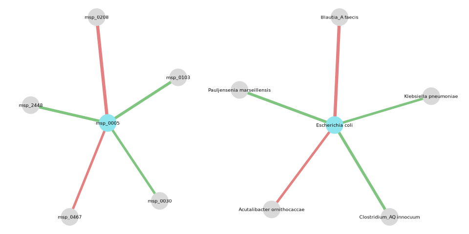
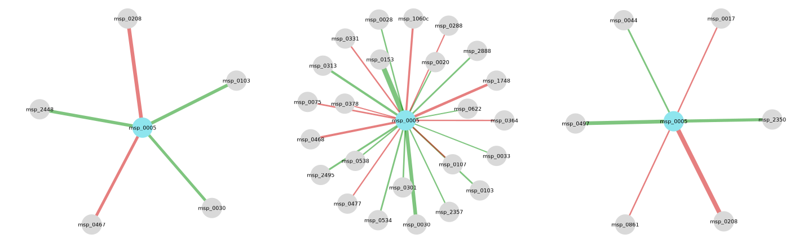
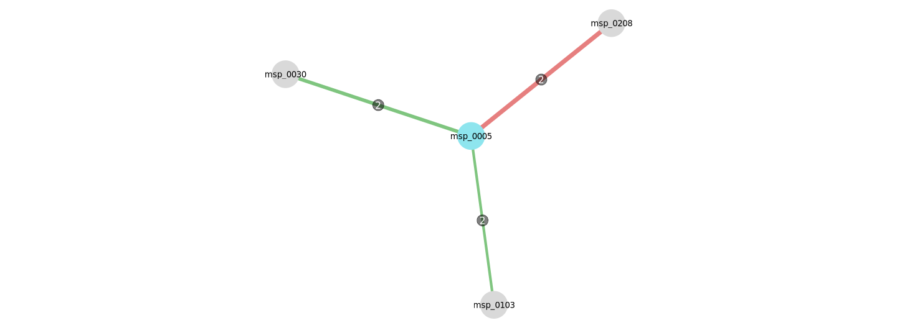

# NeighborFinder

NeighborFinder is an R package enabling the reconstruction of the local
neighborhood of a species of interest in the microbial interaction
network, based on microbiome abundance data. Unlike most methods,
NeighborFinder **does not** attempt to reconstruct full networks before
extracting local neighborhoods but focuses from the start on local
interactions to gain statistical power.

Using cross-validated multiple linear regression with ℓ1 penalty and
microbiome-specific filters, our approach infers interpretable
species-centered interactions, with F1 score ≥ 0.95 on simulated
datasets ranging from 250 to 1000 samples.

Furthermore, when multiple abundance datasets are available for the
species of interest, NeighborFinder integrates the results obtained on
each dataset to produce a robust shortlist of high-likelihood companion
species.

NeighborFinder is tailored to microbiome data. It was specifically
developed for shotgun metagenomic data and includes a default
normalization step for such datasets, but can accommodate metabarcoding
data (and other count-based inputs) by skipping it.


## Installation

The latest NeighborFinder version is available from the public [github
repo](https://github.com/metagenopolis/NeighborFinder).

``` r
if (!requireNamespace("remotes")) {
  install.packages("remotes")
}
remotes::install_github("metagenopolis/NeighborFinder")
```

## Getting started

**1. Download data**

We use the data provided in the package: abundance tables from three
datasets. NeighborFinder requires an abundance table (`data`) (with
species as rows and samples as columns) and can use a taxonomic
affiliation table (`taxo`) to provide additional details on the taxa
when visualizing the results.

``` r
library(neighborfinder)
data(data)
data(taxo)
```

**2. Apply NeighborFinder on a species of interest**

Let’s find the neighborhood of *Escherichia coli* using the abundance
data from the Japanese patients in this
[cohort](https://doi.org/10.57745/7IVO3E) (`data$CRC_JPN`).

``` r
res_CRC_JPN <- apply_NeighborFinder(
  data_with_annotation = data$CRC_JPN,
  object_of_interest = "Escherichia coli",
  col_module_id = "msp_id",
  annotation_level = "species",
  prev_level = 0.30,
  filtering_top = 30
)
```

**3. Visualize the corresponding network**

The species identified as neighbor can then be visualized using
[`visualize_network()`](reference/visualize_network.md) with or without
taxonomic annotation.

``` r
plot_JPN <- visualize_network(
  res_CRC_JPN,
  taxo,
  object_of_interest = "Escherichia coli",
  col_module_id = "msp_id",
  annotation_level = "species",
  label_size = 5
)

plot_JPN_annot <- visualize_network(
  res_CRC_JPN,
  taxo,
  object_of_interest = "Escherichia coli",
  col_module_id = "msp_id",
  annotation_level = "species",
  label_size = 5,
  annotation_option = TRUE,
  seed = 2
)

library(patchwork)
plot_JPN + plot_JPN_annot + plot_layout(widths=c(1,1.3))
```



**4. Use different datasets**

We can repeat the process to the two other datasets: the Chinese
patients (`data$CRC_CHN`) and the European patients (`data$CRC_EUR`).

``` r
# CHINA
res_CRC_CHN <- apply_NeighborFinder(
  data$CRC_CHN,
  object_of_interest = "Escherichia coli",
  col_module_id = "msp_id",
  annotation_level = "species",
  prev_level = 0.30,
  filtering_top = 30,
  covar = ~study_accession,
  meta_df = metadata$CRC_CHN,
  sample_col = "secondary_sample_accession"
)

plot_CHN <- visualize_network(
  res_CRC_CHN,
  taxo,
  object_of_interest = "Escherichia coli",
  col_module_id = "msp_id",
  annotation_level = "species",
  label_size = 5
)

# EUROPE
res_CRC_EUR <- apply_NeighborFinder(
  data$CRC_EUR,
  object_of_interest = "Escherichia coli",
  col_module_id = "msp_id",
  annotation_level = "species",
  prev_level = 0.30,
  filtering_top = 30,
  covar = ~study_accession,
  meta_df = metadata$CRC_EUR,
  sample_col = "secondary_sample_accession"
)

plot_EUR <- visualize_network(
  res_CRC_EUR,
  taxo,
  object_of_interest = "Escherichia coli",
  col_module_id = "msp_id",
  annotation_level = "species",
  label_size = 5
)
```

``` r
plot_JPN | plot_CHN | plot_EUR
```



**5. Aggregate the results**

The results from all three datasets are combined. In this aggregated
network, we selected the edges detected in at least 2 out of the 3
datasets.

``` r
final_net <- intersections_network(
 res_list = list(res_CRC_JPN, res_CRC_CHN, res_CRC_EUR),
 taxo,
 threshold = 2,
 "Escherichia coli",
 col_module_id = "msp_id",
 annotation_level = "species",
 label_size = 7,
 edge_label_size = 4,
 node_size = 15
)

plot_spacer() + final_net + plot_spacer() + plot_layout(widths=c(0.5,1,0.5))
```



## Full tutorial

The [vignette](articles/NeighborFinder_vignette.md) provides an overview
of the various use cases of NeighborFinder through examples based on
real data extracted from this
[repository](https://doi.org/10.57745/7IVO3E).
