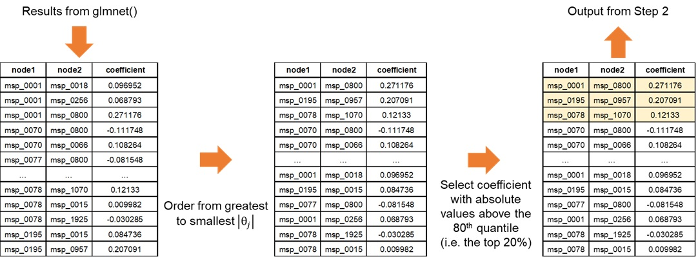

```{r, include = FALSE}
knitr::opts_chunk$set(
  collapse = TRUE,
  comment = "#>"
)
```

```{r setup}
library(rmarkdown)
library(knitr)
library(neighborfinder)
```

### Why use NeighborFinder?

* NeighborFinder helps you find the direct neighbors of a certain object of interest (bacterial species, functional module, etc). 

* Applying NeighborFinder to multiple datasets makes predictions more robust. Identified neighbors can thus be used to design microbial communities, probiotics or live biotherapeutic products (LBP). 

* NeighborFinder can also help to identify specific ecological niches linked to particular diseases.


### How to use it?

* Install package cf. [README](../README.html)

* Apply it on abundance tables of metagenomic data gathering at least 100 samples for better performance.

* See the [vignette](NeighborFinder_vignette.html) included in the package. It reviews the main functions that are useful for making the most of the NeighborFinder's features.


### Input dataframe format

The required data format in input is as follows: module IDs are the rows and samples are the columns. The first column must be the <span style="color:#5594E5;"><strong>modules name</strong></span> (e.g. species), the second is the <span style="color:#FFD91D;"><strong>module ID</strong></span> (e.g. msp), and each subsequent column is a <span style="color:#7AD370;"><strong>sample</strong></span>. “X” is a numeric value corresponding to an abundance provided either as count or a metagenomic abundance. Here is an example when the <span style="color:#5594E5;"><strong>modules name</strong></span> is the species name and the <span style="color:#FFD91D;"><strong>module ID</strong></span> is the MSP_name.

```{r fig1, echo=FALSE, fig.align='center', out.width="80%"}
knitr::include_graphics("./Technical_report_figures/fig1.jpg")
```

<center>Figure 1: Example of dataset and required format</center>


### What is behind apply_NeighborFinder() ?

Here is a description of how the function works.

```{r fig2, echo=FALSE, fig.align='center', out.width="100%"}
knitr::include_graphics("./Technical_report_figures/workflow_top_only.png")
```

<center>Figure 2: Description of the architecture of apply_NeighborFinder() </center>

<br>

#### 1)	Pre-processing: Counts & Normalization

##### a) Prevalence filter & shotgun pre-treatment

The first step of ```apply_NeighborFinder()``` is to filter the input abundance data, provided in the above format, using the parameter ```prev_level```. This step helps simplify the dataset by filtering out rare species.

The transformation of the abundance data into a count table consists in first transposing the data (so that the samples are in rows and the module IDs are in columns). Then, the abundances are transformed to counts using ```get_count_table()``` extracted from the ```OneNet``` package. This is done by dividing all values by the smallest positive abundance and rounding the results, so that the minimum count is 1. 

$B_{ij} = \lfloor A_{ij}/A_{min}\rfloor$   where $A_{\text{min}} = \min_{\{i,j : A_{ij} \neq 0\}} A_{ij}$
where $A$ is the abundance table and $B$ the resulting count table. Note that the rows of $A$ (and $B$) are samples $i \in \{1,...,n\}$ and the columns are module IDs $j \in \{1,...,p\}$.

<br>

##### b) Normalization

The next step consists in applying a mclr normalization to the previously transformed abundance data.
Here is the equation corresponding to the mclr transformation:

$C_j = {mclr}_\epsilon   (B_j)$
where $B$ is the count table and $C$ the resulting normalized count table.
Unlike the clr normalization, mclr preserves the zeros in the dataset.

The function ${mclr}_\epsilon$  is defined as follows. Consider a vector $x\in R_+^p$  of compositions, and and without loss of generality, assume that the first $q$ elements of $x$ are zero, and that all other elements are positive. 

Then ${mclr}_\epsilon(x)$ is defined by:

$y= {mclr}_\epsilon(x)  = [0,...,0,\log\{{x_{q+1}/g(x)}\}+\epsilon  ,...,\log\{{x_j/g(x)}\}+\epsilon  ,...,\log\{{x_p/g(x)}\}+\epsilon ]$

where $g(x) = {(\prod^{p}_{j=q+1}x_j)}^{1/(p-q)}$ is the geometric mean of the non-zero elements of $x$.

When ${mclr}_\epsilon$ is applied to the abundance table $B$, we apply it rowwise (that is to each sample $B_i$) and use $\epsilon =∣ z_{min} ∣ + 1$

where $z_{min} = {min }_{{ij:B}_{ij}\neq 0}{ log\{{B_{ij}/g(B_i)}}\}$.

<br>

#### 2)	Regularized linear regressions

##### a)	Simple case: no covariates

We consider a linear regression problem where we regress the abundance $C_{j0}$ of module $j0$ against the abundances of all others modules ${(C_j)}_{j\neq j0}$. The function ```glmnet::cv.glmnet()``` is applied on the normalized data 10 times, each time with a different seed. The following model is used:

$C_{j0} = \theta_1  C_1 +...+ \theta_{j0-1}  C_{j0-1} + \theta_{j0+1}  C_{j0+1} +...+ \theta_p  C_p +\epsilon$

where $C$ is the normalized count table obtained at the end of step 1) and $j0$ designates the column of the module of interest in $C$. $\theta_j$  is the regression coefficient of $j0$ against $j$, and $\epsilon$ is the residual error, assumed to be gaussian with $\sigma^2  I_n$  covariance.

Since $p$ is usually bigger than $n$ and we want a sparse vector $\theta$, we use $l_1$–regularization to select a small number of non null coefficients in $\theta$. The modules for which $\theta_j \neq 0$ corresponds to a potential neighbors of module $j0$.

This translates to the following minimization problem:

$argmin{_{\theta}{({‖C_{j0}-X\theta‖}^2+{\lambda‖\theta‖}_1)}}$

where ${X=C}_{-j0}$  is the design matrix composed of the abundances of all modules but $j0$, and $\lambda$ is the penalization term enforcing the strength of the regularization and thus the number of non null coefficients. We solve this problem using ```glmnet::glasso()``` and use cross-validation to tune the parameter $\lambda$. 

<br>

##### b)	Handling covariates

Covariates can be included in the model by considering an $X$ made of two distinct components: $C_{-j0}$ , previously defined, and $D$, the design matrix of the covariates. 

$D$ the metadata matrix where some columns are considered as covariates.
Here is the necessary transformation: 

$[\matrix{D&C_{-j0}}]$ $[\matrix{\alpha\\\theta}]$

The penalization $\lambda$ only applies on coefficients $\theta_i$ and not on $\alpha$.

Minimization of the objective function: 

${minimize}_{\theta ,\alpha}  ({‖C_{j0}-C_{-j0}\theta -D\alpha ‖}_2+\lambda {‖\theta ‖}_1)$

In practice, $D$ and $C_{-j0}$  are concatenated into a single matrix which is used as the input of ```cv.glmnet()``` and $D$ is constructed from a covariate dataframe using either *(i)* the formula interface, or *(ii)* specifying the name of a single column used as covariate. 

To use covariates, 3 additional arguments are required: 

* ```covar```: takes a formula or the name of the column of the covariate in the metadata table. 

* ```meta_df```: the dataframe giving metadata information.

* ```sample_col```: the name of the column in metadata indicating the sample names.

See part “Apply NeighborFinder with covariate option” in the [vignette](NeighborFinder_vignette.html) for a detailed example.

<br>

#### 3)	Post-processing

##### a)	Filtering the results

This step enables NeighborFinder to have better performances than with the naive glmnet method. For each seed-generated result, a filter is applied to increase the reliability of detected interactions. This is done with the ```top_filtering parameter```: it consists in keeping only the strongest coefficients. If ```top_filtering``` is set to 10%, the coefficients conserved must be greater in absolute value than the 90th quantile of all coefficients detected for the neighbors of a species of interest. 

```{r fig3, echo=FALSE, fig.align='center', out.width="100%"}

```

<center>Figure 3: Filtering process</center>

##### b)	Increasing robusteness

To gain in robustness, only neighbors detected several times are kept. The function ```apply_NF_simple()``` is run on 10 seeds and results found are kept if only found in at least half of the seeds. 
This process ensures more robust results. This step merges the 10 filtered results (each corresponding to a seed) and eliminates edges detected in less than half of the results. For a kept interaction, the median of the different coefficients is calculated and saved in the final output. The final result is an edge table of the interactions that were stronger and found in at least half of the 10 seed-generated results.

Performance scores were way better with this repetition approach than running the developed method on a single seed (see Figure 4).

<br>

### How to calibrate the parameters values ?

The function ```apply_neighborfinder()``` has two important parameters (```prev_level``` and ```top_filtering```) that shape the output. It is also acknowledged that the dataset size usually has an impact on the generated network. Our performance assessment strategy therefore consisted in covering a range of values for both parameters, with the aim of providing users with guidelines to pick the most suitable combination for their dataset size. We tested the performance of NeighborFinder on eight shotgun metagenomic cohorts (sample sizes ranging from 347 to 1084) detailed here doi_recherhche_data_gouv.

For each of the eight large cohorts, a graph with "cluster-like" structure was generated with the ```graph_step()``` function. A precision matrix $\Omega$ with non-null coefficients respecting the graph topology was produced and then inverted to produce a covariance matrix ${\Sigma}$. Semi-synthetic simulated datasets of sizes n=100, n=250, n=500, and n=1000 samples were generated using gaussian copula from the covariance matrix ${\Sigma}$ and the original count matrix to produce count tables that *(i)* have the same marginal counts distributions as the original cohort *(ii)* while enforcing the correlation between taxa encoded in ${\Sigma}$. The graph edges are here considered as true edges (ground truth).

On 10 different seeds, for each value of ```prev_level``` tested (from 15% to 35%, by increment of 5%), and for each bacterial species, the ```cv.glmnet()``` function was applied to each simulated dataset (via the function ```cvglm_to_coeffs_by_object()``` from the ```NeighborFinder``` package). This part corresponds to the first steps of the method (see Figure 2, step 1 and step 2 at top). 
The results were then filtered as in the procedure of ```apply_NeighborFinder()``` (see Figure 2, step 2 at bottom) to keep only a ```filtering_top``` percentage of the coefficients, ranging from 5% to 30% in 5% increments, and 100% corresponding to not filtering results. 
The final results were obtained by going through the last step of the method (see Figure 2 step 3) with the selection of interactions if they were detected in at least 5 of the 10 results (each corresponding to a seed) for each pre-mentioned case.

Performance scores (F1) were calculated by comparing the true edges of the graph with the detected neighbors, averaging on bacterial species and cohort datasets. 
The same procedure was done on simulated datasets of size n=50, but with a ```prev_level``` range from 30% to 60% by increment of 5%.


```{r fig4, echo=FALSE, fig.align='center', out.width="100%"}
knitr::include_graphics("./Technical_report_figures/heatmap_100-1000_appnote_NB.jpg")
```

<center>Figure 4: Performance scores on simulated data</center>
<br>

Based on the performance scores calculated on simulated data, parameter pair choices (```prev_level``` and ```filtering_top```) should be adjusted according to the size of the dataset on which the user wishes to use NeighborFinder. When dealing with large datasets, the user has plenty of parameter combinations that lead to an equivalent expected performance, with the dark green areas indicating a high F1 score (>=0.9) in Figure 4. One choice could be to select a low value of ```prev_filter``` to include as many bacterial species as possible and then choose the ```filtering_top``` value to ensure satisfactory optimum performance. For example: with n=1000, ```prev_level```=0.15 and ```filtering_top```=30. As the dataset size decreases, the user is advised to increase the ```prev_level``` value while maintaining a high value of ```filtering_top```. 

<br>

The function ```choose_params_values()``` has been designed to allow the user to obtain a more specific indication based on the dataset provided and the module of interest. This function works in the same way as the procedure described previously:

*	Generation of a graph

*	Simulation of a dataset respecting the dependencies between taxa encoded in the graph, for different prevalence levels

*	Application of ```apply_NF_simple()``` on 10 seeds, with and without filtering top results (testing different percentages) 

* Application of the robustness step (filtering interactions if they are found in at least half of the seeds-generated results)

*	Comparison and computation of F1 score:

  - *before* (```filtering_top```=100 and no robustness step) 

  - *after* the filtering & robustness steps

The user can then decide which values of these parameters to use for downstream analysis and pass them on to ```apply_NeighborFinder()``` using the arguments ```prev_level``` and ```filtering_top```. 

<br>
<br>
